<style>
em {
  font-style: italic
}

strong {
  font-weight: bold;
}

sup {
  top: -0.5em;
  vertical-align: baseline;
  font-size: 75%;
  line-height: 0;
  position: relative;
}
</style>


## Introdução

```g
Iniciativa conjunta (Educação, Meio Ambiente, Minas e Energia, Ciência e Tecnologia,   
Defesa, governo de Pernambuco) para integrar Fernando de Noronha ao continente  
brasileiro por meio de cabos submarinos (energia e comunicações).
```
### **Objetivo estratégico**

Programa para implementação de **_plataforma de desenvolvimento de tecnologia_**, envolvendo recentes avanços tecnológicos, onde projeto piloto fundamental será a conexão de Fernando de Noronha à cidade de Natal (no continente)

### **Parcerias iniciais**

ANEEL, ANATEL, AGU, CHESF, CELPE, CENPES/PETROBRÁS, EPE, UFPE, UNICAMP, ...

---

## Estrutura

</br>
<div style='text-align: center;'>
    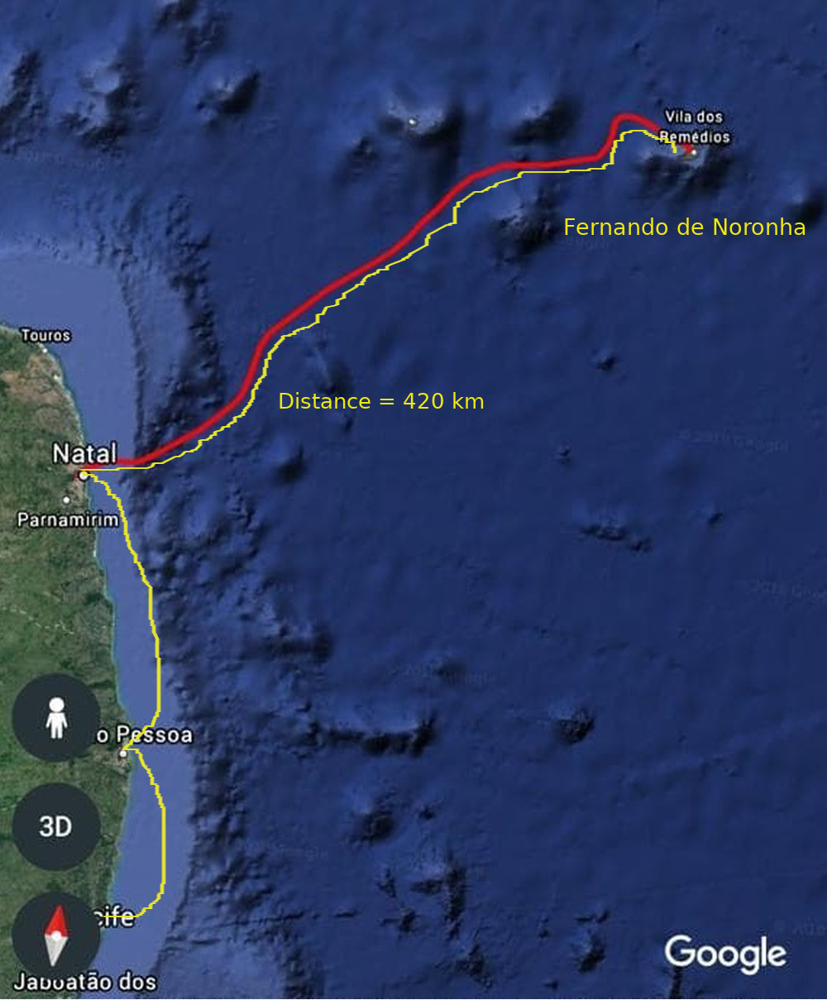
</div>

---

## Motivação


+ <span style="color:green; font-weight:bold">Transmissão de energia elétrica, gerada no continente (renovável), em substituição à conversão diesel-eletricidade (local)</span>


+ <span style="color:green; font-weight:bold">Comunicações ópticas submarinas (tecnologia DWDM) como capacidade/benefício complementar</span>


+ <span style="color:green; font-weight:bold">Sensoriamento distribuído (tecnologia disruptiva) em suporte a P & D realizada em Centros de Pesquisa e Universidades (nacionais e internacionais)</span>

---

## Link HVDC

</br>
<div style='text-align: center;'>
    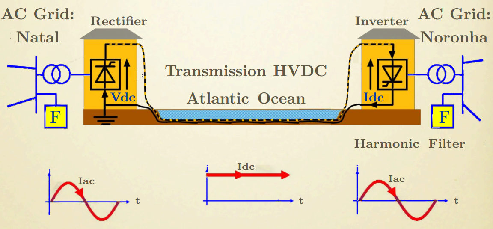
</div>

---

## Fernando de Noronha: DADOS DISPONÍVEIS

+ <span style="color:green; font-weight:bold">   Eletricidade é predominatemente de origem termelétrica:</span><span style="color:gray"> **_Usina Termelétrica de Tubarão_**</span>


+ <span style="color:green; font-weight:bold">  A geração solar (Noronha I e Noronha II)
é limitada: 10% da demanda atual no pico </span>


+ <span style="color:green; font-weight:bold">  A energia eólica está indisponível há vários anos, sujeita a restrições de natureza técnica e ambientais</span>


+ <span style="color:green; font-weight:bold">  As comunicações são de baixa qualidade (satelital)</span>


+ <span style="color:green; font-weight:bold">Local ideal para o funcionamento de um centro internacional de pesquisas climáticas no Atlântico Sul </span>


+ <span style="color:green; font-weight:bold">Papel relevante nas mudanças climáticas (como projeto piloto para o meio ambiente) </span>

+ <span style="color:green; font-weight:bold">Ponto de partida para o desenvolvimento de futuras
aplicações para áreas remotas, como Amazônia,
Alaska, etc. </span>

---

## Premissas

+ <span style="color:green; font-weight:bold">  Demanda de energia elétrica em FN é da ordem de 2.6 MW. Uma pequena parcela em torno de 10 MW, derivada do SIN (Sistema Interligado Nacional - 150
GW), pode ser transmitida até FN</span>


+ <span style="color:green; font-weight:bold">  Avanços recentes em novos materiais viabilizam a fabricação e instalação de cabos de potência mais leves em águas profundas</span>


+ <span style="color:green; font-weight:bold">  Avanços em dispositivos de estado sólido no campo da eletrônica de potência, tais como as novas famílias de __IGBTs__, viabilizaram a transmissão de energia elétrica por cabos submarinos, cobrindo longas distância, de forma eficiente, com destaque para a tecnologia VSC-HVDC</span>


+ <span style="color:green; font-weight:bold"> Avanços continuados nos sistemas de comunicações ópticas submarinos, tais como amplificação óptica, detecção coerente e tecnologia DWDM, associados  à redução progressiva de custos com aumento de banda, sugerem a inclusão desta capacidade numa configuração standard sem repetição</span>

---

## Proposta Simplificada

+ <span style="color:green; font-weight:bold"> Implementação de um sistema de distribuição elétrica, baseado na tecnologia  VSC-HVDC, interligando Natal a FN por meio de cabos submarinos de potência</span>


+ <span style="color:green; font-weight:bold">  Implementação de um sistema de comunicações ópticas, por meio de cabo submarino de fibra óptica, conectando Natal a FN</span>


+ <span style="color:green; font-weight:bold"> Implementação de um sistema de sensoriamento submarino por meio de rede de sensores distribuídos, embutidos na infraestrutura de comunicações, como plataforma de pesquisa</span>

---

## Link HVDC

</br>
<div style='text-align: center;'>
    
</div>

---  

##  Diagrama em Blocos

</br>
<div style='text-align: center;'>
    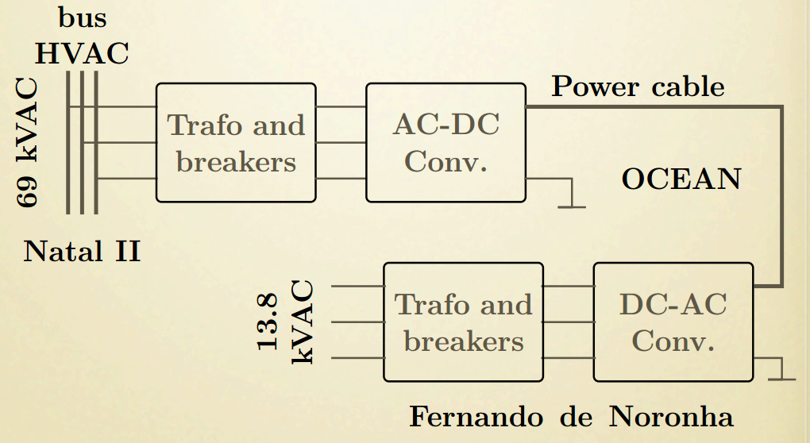
</div>

---

## Matriz Nacional de Energia Elétrica

</br>
<div style='text-align: center;'>
    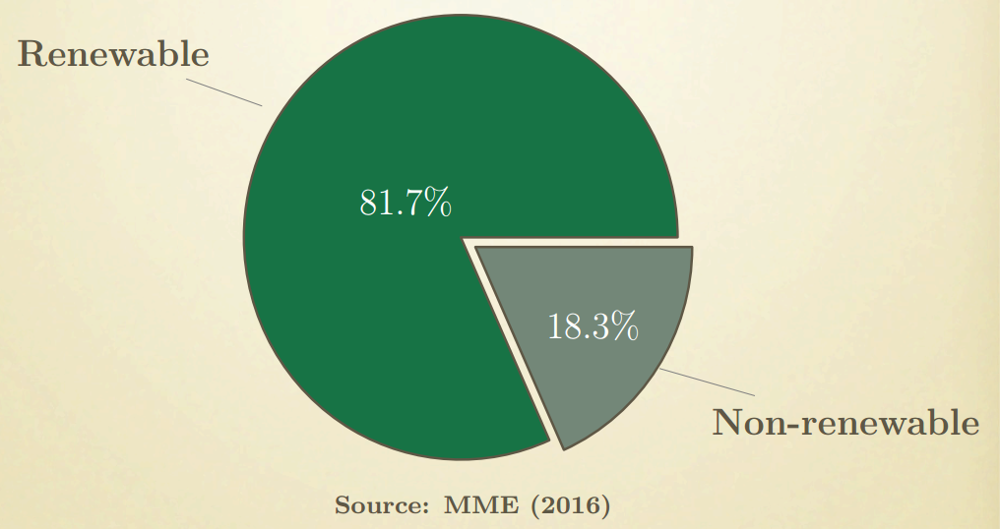
</div>

---

## Fontes Renováveis

</br>
<div style='text-align: center;'>
    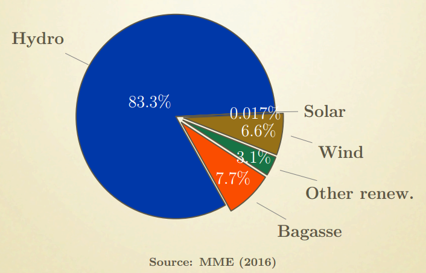
</div>

---

## Imagens Representativas

</br>
<div style='text-align: center;'>
    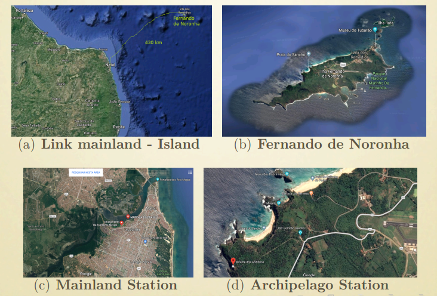
</div>

---

## FN - Desequilíbrios

+ <span style="color:gray; font-weight:bold"> _Patrimônio Natural da Humanidade (UNESCO)_</span>


+ <span style="color:gray; font-weight:bold">  _O consumo de combustíveis fósseis é superior a 5 milhões de litros a cada ano_</span>


+ <span style="color:gray; font-weight:bold"> _A emissão de dióxido de carbono é superior a 14 mil toneladas por ano_</span>


+ <span style="color:gray; font-weight:bold"> _13 000 m<sup>2</sup> de área permanentemente ocupada para atender a menos de 10% da demanda
 (na geração solar) - solução não escalável_</span>


+ <span style="color:gray; font-weight:bold"> _As baterias de armazenamento de energia para as fontes intermitentes são caras, poluentes e não recicláveis economicamente, agora e em um futuro próximo, pelo que sabemos_ </span>

---

## Cabo DC
# Requisitos Básicos
</br>


Circuit technical data    | Value
 -------------- | ------------
 Cable outer diameter      | 68 mm
 Weight in air, approx.          | 10.4 kg/m
 Weight Submerged, approx   | 6.6 kg/m
 Min. bending radius        | 1.2 m
 Transmission capacity           | 10 MW
 Nominal voltage           | 60 kV
 Current (calculated to fulfil 10 MW requirement) | 200 A
 Losses (@ 200 A)          | 5.0 W/m
 Voltage drop (@ 200 A)    | 25.2 kV

---

## Cabo Óptico
# Requisitos Básicos
</br>

Circuit technical data    | 1.9 mm | 3.6 mm
 -------------- | ------------ | ------------
 Cable outer diameter      | 26 mm | 29 mm
 Weight in air, approx.    | 1.5 kg/m | 2.3 kg/m
Weight Submerged, approx   | 1.0 kg/m | 1.6 kg/m
Min. bending radius        | 0.95 m   | 0.95 m
Attenuation                | 0.17 dB/km | 0.17 dB/km

---

## Conversores
# Requisitos Básicos
</br>

Technical elements |
 -------------- |
Distribuition system network req. |
Monopole configuration with earth/sea return |
Stations: power between 10 and 20 MW, approx. |
VSC-based HVDC power transmission |
AC grid (mainland station): 69 kVAC, 60 Hz |
AC grid (FN station): 13.8 kVAC, 60 Hz |
Container-based installation |
Available area (FN): 15m × 15m |

---

## Estado-da-Arte

</br>
<div style='text-align: center;'>
    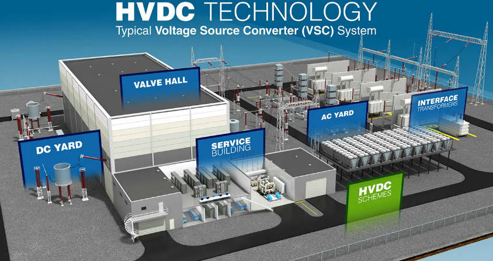
</div>

---

## Partes e Parcelas

<div style='text-align: center;'>
    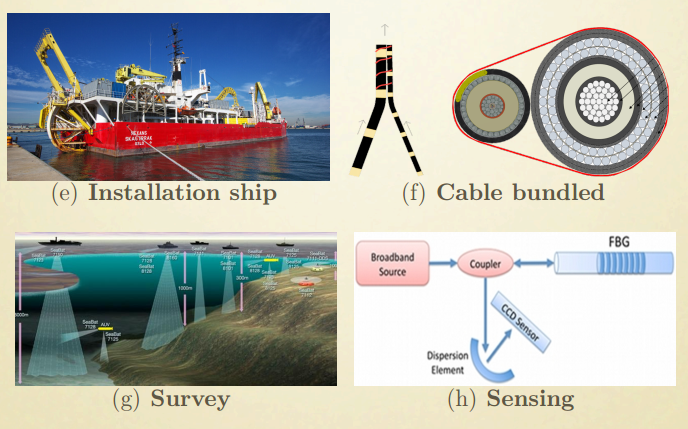
</div>

---

## Modelagem para a implantação

+ <span style="color:green; font-weight:bold"> Ações estratégicas coordenadas por um comitê de alto nível (MD, RNP, ICMBio, MCTIC, ANEEL) </span>


+ <span style="color:green; font-weight:bold">Contratações realizadas pela RNP, com a parte técnica sendo conduzida conjuntamente pelas engenharias da RNP e do Ministério da Defesa</span>


+ <span style="color:green; font-weight:bold"> __Governança:__ Modelo de gestão dinâmica de programas para garantir a sustentabilidade dos benefícios</span>

+ <span style="color:green; font-weight:bold"> Estratégia: trabalho em parceria, avançando continuamente, conforme captação de recursos </span>

+ <span style="color:green; font-weight:bold"> Necessidade de marco regulatório: ANEEL </span>

---

## Ações destacadas em 2018

+ <span style="color:green; font-weight:bold"> Contratação dos serviços de survey </span>

+ <span style="color:green; font-weight:bold"> Elaboração de diversos Request for Information (RFI)</span>

+ <span style="color:green; font-weight:bold"> Realização de variados estudos comparativos e construção de parcerias estratégicas </span>

+ <span style="color:green; font-weight:bold"> Visitas técnicas: propostas de desenvolvimento conjunto </span>

---

## Entrega mais recente ##
# Survey

<div style='text-align: center;'>
    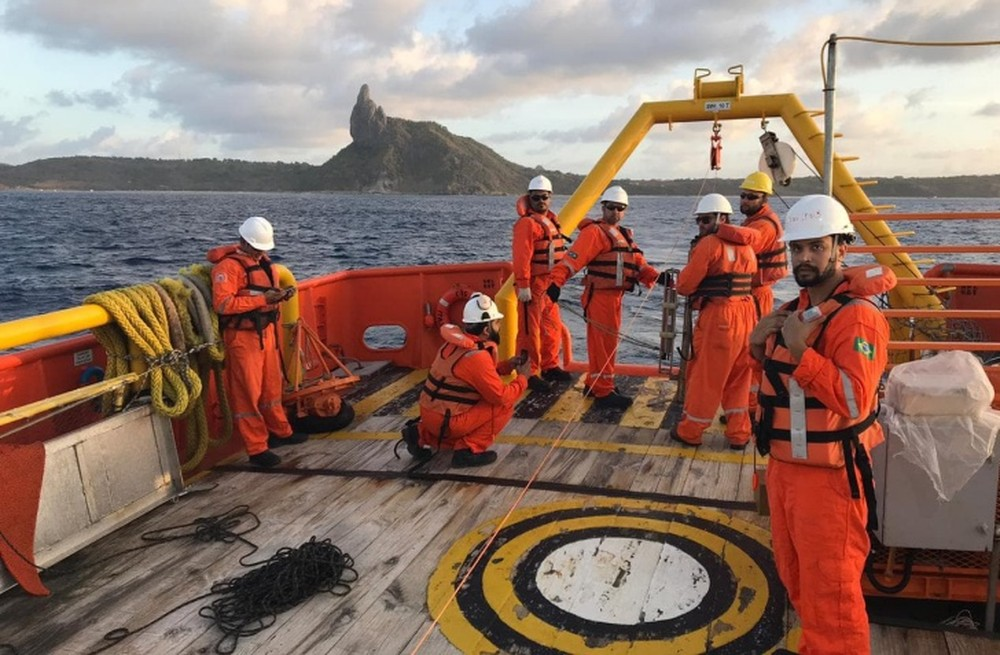
</div>


---

## Big Picture

<div style='text-align: center;'>
    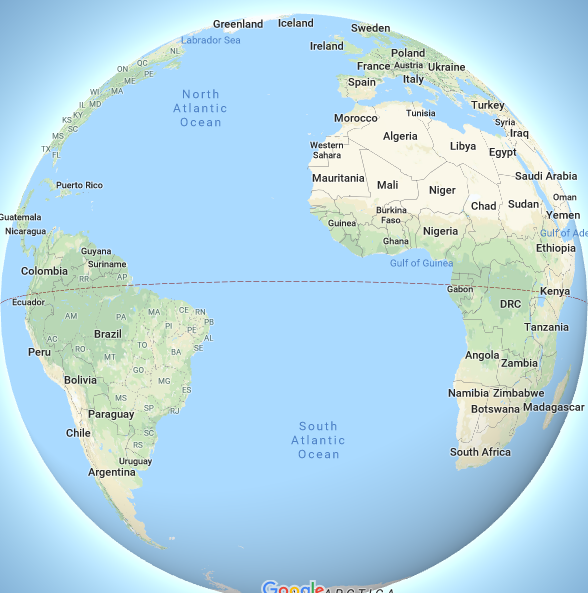
</div>

---

## Extensão

<div style='text-align: center;'>
    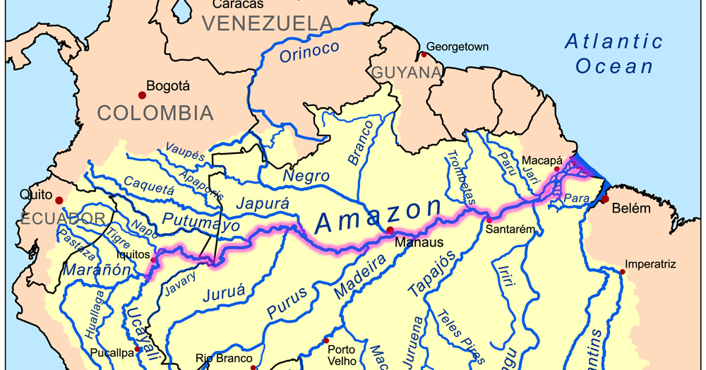
</div>

---

## Considerações Finais

+ <span style="color:green; font-weight:bold"> Não é um projeto do setor de energia elétrica</span>


+ <span style="color:green; font-weight:bold">  Primeiro sistema deste tipo no Brasil (tecnologia VSC-HVDC)</span>


+ <span style="color:green; font-weight:bold"> Cabo de potência ainda não construído</span>


+ <span style="color:green; font-weight:bold"> Cooperação/colaboração é requisito central (centro de gravidade)</span>


+ <span style="color:green; font-weight:bold"> Benefício considerável para o meio ambiente </span>


+ <span style="color:green; font-weight:bold"> Não envolve solução de prateleira </span>


+ <span style="color:green; font-weight:bold"> Extensão para áreas remotas</span>
</br></br>

<p style='text-align: right;'> Muitíssimo Obrigado! </p>
